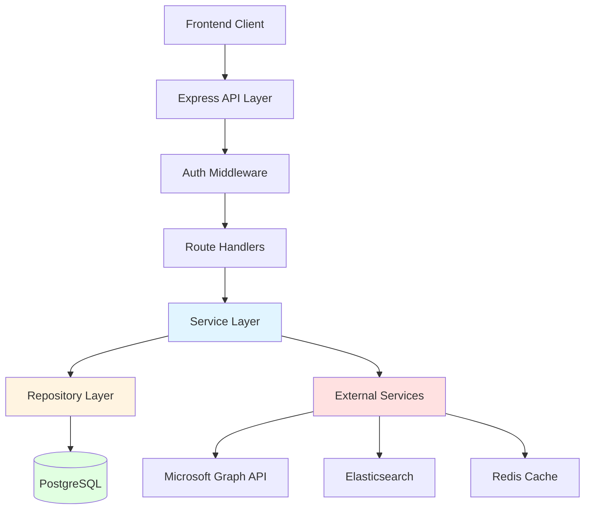
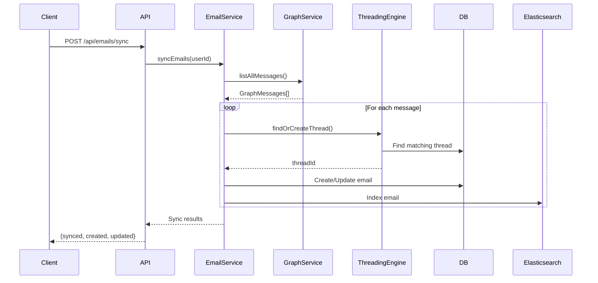
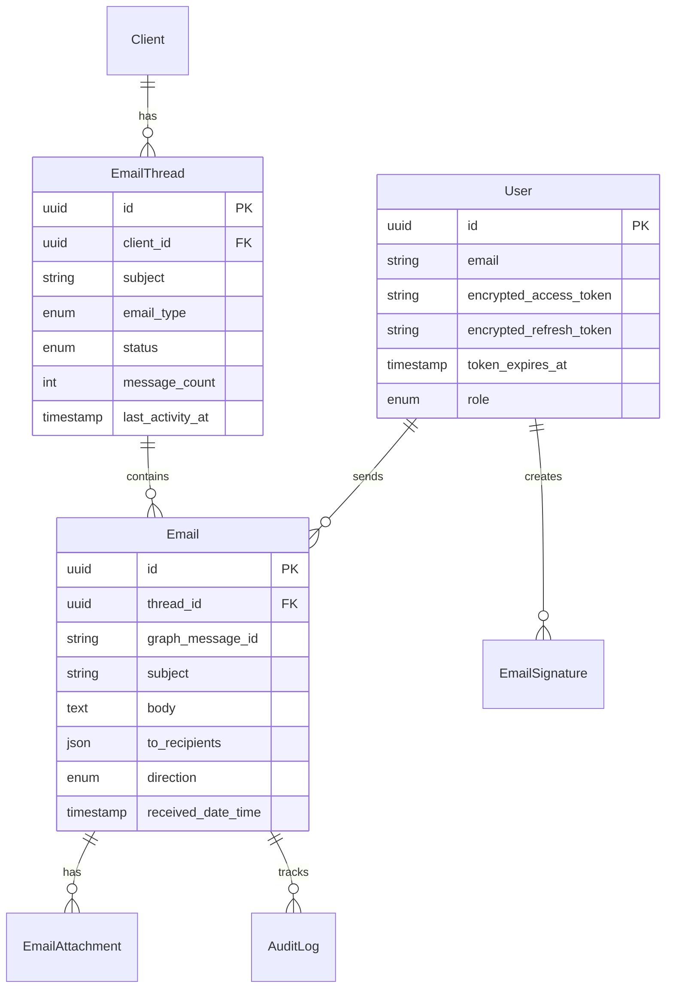

# Email Backend Architecture

## Overview

The Email Backend is a production-ready Node.js/TypeScript application that provides comprehensive email management functionality through Microsoft Graph API integration. It serves as the backend for a tax-focused email management system with advanced threading, classification, and search capabilities.

## System Architecture

### High-Level Architecture



### Layer Responsibilities

#### 1. **Routes Layer** (`src/routes/`)
- HTTP request handling and routing
- Input validation using Zod schemas
- Response formatting
- Rate limiting and authentication middleware

**Key Routes:**
- `auth.routes.ts` - OAuth authentication flow
- `emails.routes.ts` - Email CRUD operations
- `threads.routes.ts` - Thread management
- `search.routes.ts` - Full-text search
- `webhooks.routes.ts` - Microsoft Graph webhook handling
- `clients.routes.ts` - Tax client management
- `templates.routes.ts` - Email templates and signatures

#### 2. **Services Layer** (`src/services/`)
- Business logic implementation
- Orchestration of multiple operations
- Integration with external services
- Data transformation and processing

**Core Services:**

| Service | Responsibility |
|---------|---------------|
| `auth.service.ts` | OAuth 2.0 flow, JWT generation, token refresh |
| `email.service.ts` | Email CRUD, sending, syncing from Graph API |
| `threading.service.ts` | 7-layer email threading algorithm |
| `graph.service.ts` | Microsoft Graph API wrapper |
| `classification.service.ts` | Tax-specific email categorization |
| `sync.service.ts` | Background sync and webhook management |
| `search.service.ts` | Elasticsearch integration for full-text search |
| `audit.service.ts` | Compliance and activity logging |

#### 3. **Repository Layer** (Future Enhancement)
- Direct database access using Prisma ORM
- Query optimization and caching
- Data access abstraction

#### 4. **Middleware** (`src/middleware/`)
- `auth.ts` - JWT authentication and RBAC
- `errorHandler.ts` - Centralized error handling
- `rateLimiter.ts` - API rate limiting
- `logger.ts` - Request/response logging

#### 5. **Configuration** (`src/config/`)
- Environment variable management with Zod validation
- Database connection (Prisma)
- Redis connection
- Elasticsearch connection

## Data Flow

### Email Sync Flow



### Email Threading Algorithm

The threading engine uses a sophisticated 7-layer matching algorithm:

1. **Microsoft Conversation ID** - Native Graph API conversation grouping
2. **Tax Email ID** - Custom header for guaranteed threading
3. **Internet Message ID** - RFC 5322 standard
4. **In-Reply-To** - Direct reply relationship
5. **References** - Email chain references
6. **Subject + Participants** - Fuzzy matching with time window
7. **Fallback** - Create new thread

## Database Schema

### Core Models



## External Integrations

### Microsoft Graph API

**Authentication**: OAuth 2.0 with refresh tokens (encrypted at rest)

**Key Operations**:
- User profile fetching
- Email sync with pagination
- Send/Reply/Forward emails
- Attachment management
- Webhook subscriptions for real-time updates

**Error Handling**: Automatic token refresh on 401, retry logic with exponential backoff

### Elasticsearch

**Purpose**: Full-text search across email content

**Index Structure**:
```json
{
  "emails": {
    "mappings": {
      "properties": {
        "subject": { "type": "text" },
        "body": { "type": "text" },
        "fromAddress": { "type": "keyword" },
        "receivedDateTime": { "type": "date" },
        "emailType": { "type": "keyword" }
      }
    }
  }
}
```

**Fallback**: Database search when Elasticsearch unavailable

### Redis

**Usage**:
- Session caching
- Background job queue (BullMQ)
- Rate limiting counters
- Temporary data storage

## Security

### Authentication & Authorization

1. **OAuth 2.0** - Microsoft Azure AD integration
2. **JWT** - Stateless authentication for API requests
3. **RBAC** - Three roles: admin, accountant, client_manager
4. **Token Encryption** - AES-256-GCM for stored OAuth tokens

### Data Protection

- Sensitive data encrypted at rest
- HTTPS required in production
- Helmet.js for security headers
- Input validation with Zod
- SQL injection prevention via Prisma

### Rate Limiting

- Global: 100 requests/minute
- Auth endpoints: Stricter limits
- Email sending: Limited per user

## Monitoring & Logging

### Logging Strategy

- **Winston** logger for structured logging
- Contextual logging with module names
- Log levels: error, warn, info, debug
- Separate error log file
- JSON format for log aggregation

### Audit Trail

All significant actions logged:
- Email sent/viewed/deleted
- Thread resolved/archived
- Client associations
- Sync operations

## Performance Considerations

### Database Optimization

- Indexed fields for common queries
- Selective field loading
- Batch operations for sync
- Connection pooling via Prisma

### Caching Strategy

- Redis for frequently accessed data
- Elasticsearch for search results
- In-memory caching for config

### Background Processing

- BullMQ for async operations
- Email sync in background
- Webhook subscription renewal
- Audit log cleanup

## Development Workflow

### Local Setup

1. Install dependencies: `npm install`
2. Configure `.env` from `.env.example`
3. Start infrastructure: `docker-compose up -d`
4. Run migrations: `npm run prisma:migrate`
5. Start dev server: `npm run dev`

### Code Organization

```
src/
├── app.ts              # Application entry point
├── config/             # Configuration and DB clients
├── middleware/         # Express middleware
├── routes/             # API route handlers
├── services/           # Business logic
├── utils/              # Shared utilities
├── types/              # TypeScript types
└── workers/            # Background jobs
```

### Testing Strategy

- Unit tests for services (using Jest)
- Integration tests for routes
- E2E tests with test database
- Manual testing via Streamlit UI

## Deployment

### Production Checklist

- [ ] Set `NODE_ENV=production`
- [ ] Configure production database
- [ ] Set up Redis cluster
- [ ] Configure Elasticsearch cluster
- [ ] Set secure JWT secret (minimum 32 characters)
- [ ] Set encryption key for token storage
- [ ] Configure webhook notification URL
- [ ] Set up monitoring and alerting
- [ ] Enable HTTPS
- [ ] Configure CORS allowed origins

### Scaling Considerations

- Horizontal scaling behind load balancer
- Database connection pooling
- Redis cluster for caching
- Elasticsearch cluster for search
- Background worker processes
- CDN for static assets

## Future Enhancements

1. **Repository Pattern** - Separate data access layer
2. **Microservices** - Split into smaller services
3. **Event Sourcing** - Track all state changes
4. **GraphQL** - Alternative to REST API
5. **Real-time Updates** - WebSocket integration
6. **AI Classification** - ML-based email categorization
7. **Multi-tenant** - Support multiple organizations

## References

- [Microsoft Graph API Docs](https://docs.microsoft.com/en-us/graph/)
- [Prisma Documentation](https://www.prisma.io/docs/)
- [Express.js Guide](https://expressjs.com/)
- [TypeScript Handbook](https://www.typescriptlang.org/docs/)
